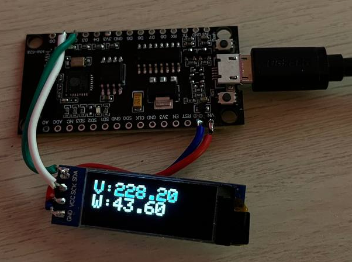

# Esp8266ShellyData

Simple example how to connect from esp8266 to shelly deice as client, get data from API v2 in json format, parse it and show parsed data on OLED display.

  

## Building

You need these libraries installed
-Esp8266 SDK
-ArduinoJson
-Adafruit_SSD1306

Just install libraries and upload firmware to your esp8266
